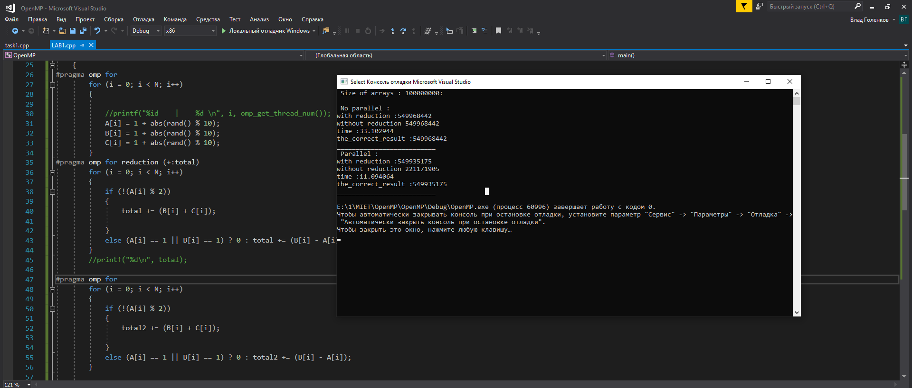

## Лабораторная работа №3
#Использование редукции

Задание 1. В соответствии с вариантом задания, написать на C++ программу программу,реализующую многопоточность на основе технологии OpenMP: 
она должна вычислять значение функции с помощью редукции. Измерять время работы программ для различных значений параметра N. Результаты занести в отчёт.

Задание 2. Модифицировать программу, составленную по Заданию 1, убрав возможность параллельного использования вычислительных ресурсов. 
Измерять время работы программы для тех же значений параметров, что были использованы при выполнении Задания 1.

Контрольные вопросы

1. Как определяются общие и локальные переменные потоков?

>shared(x1, x2, x3, ....) - по умолчанию
>Условие shared указывает на то, что все перечисленные переменные будут разделяться
>между потоками. Все потоки будут доступаться к одной и той же области памяти.

>private(x1, x2, x3, ....)
>Условие private указывает на то, что каждый поток должен иметь свою копию переменной на
>всем протяжении своего исполнения.

>default(shared|private|none)
>Это условие определяет область видимости переменных внутри параллельного участка кода
>по умолчанию.

2. Что понимается под операцией редукции?

>reduction(оператор : x1, x2, ...)
> Это условие позволяет производить безопасное вычисление. private копия каждой перечисленной переменной инициализируется при входе в параллельную секцию в
>соответствии с указанным оператором. При выходе из параллельной секции из частично вычисленных значений в каждом из потоков вычисляется результирующее и передается в
>основной поток

