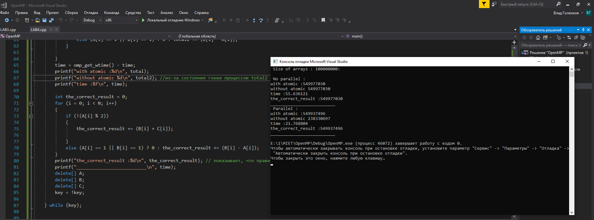

## Лабораторная работа №4
# Критические секции и атомарные операции

# Задание.
Модифицировать программу, составленную по Заданию 1 в Л.Р. №3, используя синхронизацию вместо редукции. Измерять время работы программы для тех же значений параметров,
что были использованы при выполнении Л.Р. №3. Результаты сравнить и занести в отчёт

# Контрольные вопросы

1. Что понимается под атомарной (неделимой) операцией?

>Данная директива относится к идущему непосредственно за ней оператору присваивания, гарантируя корректную работу с общей переменной, стоящей в его левой части.
>На время выполнения оператора блокируется доступ к данной переменной всем запущенным в данный момент потокам, кроме потока, выполняющей операцию.

>Синтаксис критической секции на С/С++
>>#pragma omp atomic
>>x <operator>= <expression>
>Возможные операторы : +, *, -, /, &, |, ^, >>, <<

>или

>>#pragma omp atomic <expression>
>где expression : x++, ++x, x--,--x

2. Как определяется критическая секция?

>Наличие критической секции в параллельном блоке гарантирует, что она в каждый конкретный момент времени будет выполняться только одним потоком. Т.е. когда один
>поток находится в критической секции, все остальные потоки, которые готовы в нее войти, находятся в приостановленном состояние. 

>Синтаксис критической секции на С/С++
>>#pragma omp critical [(имя)]
>>    Структурный блок